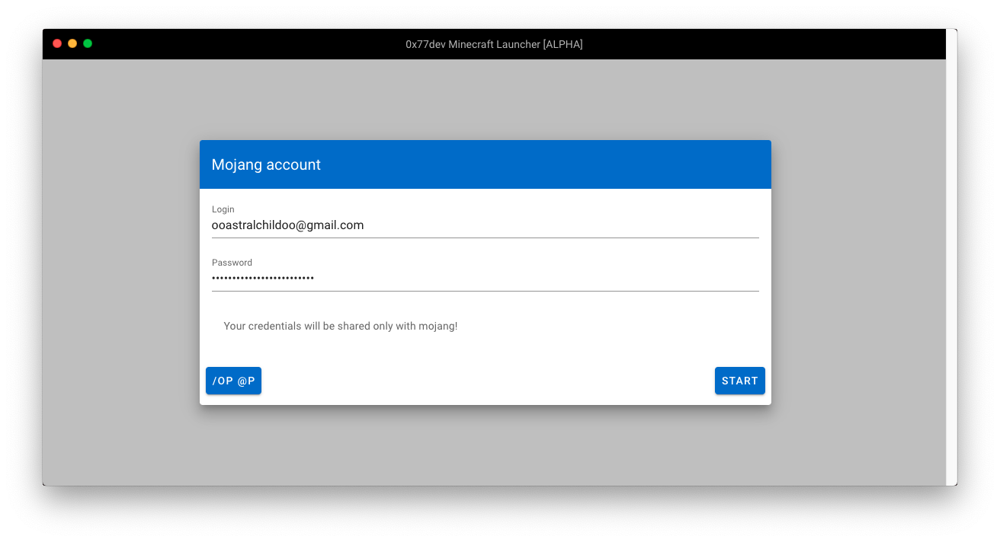

# 0x77dev Minecraft Launcher
Made specially for [My Minecraft Sever](https://minecraft.0x77.page)


[](https://github.com/devmcraft/launcher/releases)


## Preview
[](https://github.com/devmcraft/launcher/releases)

## Contributing
Feel free to fork and open PR, or create issue.

## How to work with this.
* Use [VSCode](https://code.visualstudio.com/) - Debug configuration is included in this repo.

### Developing
I recommend to use [Yarn package manager](https://yarnpkg.com)

#### Installing dependencies
```console
$ yarn install
```
#### Starting in Development mode
```
$ yarn electron:serve
```
#### Building electron app.
```
$ yarn electron:build
```
